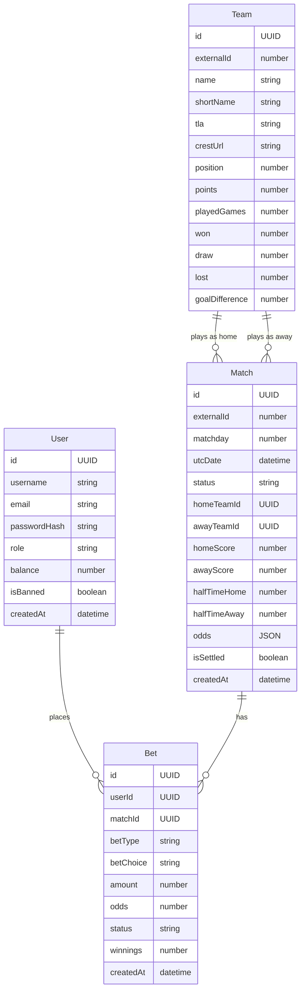

# Domain Model (ERD)

> Dựa trên: [03_UI_SCREENS.md](./03_UI_SCREENS.md), [04_BUSINESS_RULES.md](./04_BUSINESS_RULES.md)
> Chỉ high-level: entities + relationships. Chi tiết types/indexes ở bước 9 (DB Schema).

---

## Entities

### User
- id, username, email, passwordHash, role, balance, isBanned, createdAt

### Team
- id, externalId, name, shortName, tla, crestUrl, position, points, playedGames, won, draw, lost, goalDifference

### Match
- id, externalId, matchday, utcDate, status, homeTeamId, awayTeamId, homeScore, awayScore, halfTimeHome, halfTimeAway, odds, isSettled, createdAt

### Bet
- id, userId, matchId, betType, betChoice, amount, odds, status, winnings, createdAt

---

## Relationships

```
User ──1:N──> Bet       (1 user đặt nhiều bets)
Match ──1:N──> Bet      (1 trận có nhiều bets)
Team ──1:N──> Match     (homeTeam)
Team ──1:N──> Match     (awayTeam)
```



---

## Giải thích

| Entity | Lý do tồn tại |
|---|---|
| **User** | Lưu thông tin tài khoản, balance, trạng thái ban |
| **Team** | Cache thông tin đội từ API, lưu thứ hạng để tính odds |
| **Match** | Core — trận đấu, tỉ số, odds, trạng thái settle |
| **Bet** | Mỗi kèo user đặt = 1 record riêng biệt |

## Không cần entity riêng

| Có thể nghĩ cần | Lý do bỏ |
|---|---|
| Transaction/Deposit | Nạp tiền chỉ cộng balance, không cần lịch sử (v1) |
| League/Competition | Chỉ có PL, hardcode |
| Standing riêng | Position/points lưu trong Team |
| Odds riêng | Lưu JSON trong Match |
