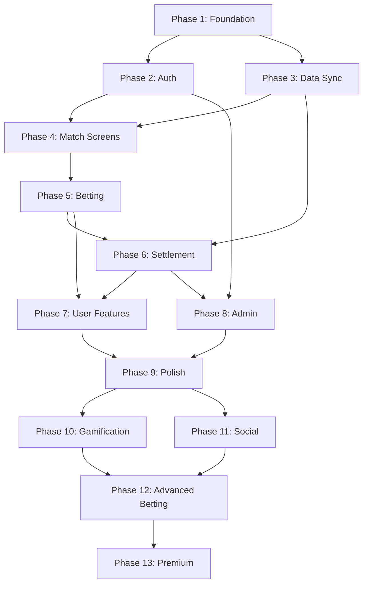

# Implementation Roadmap

> **Nguyên tắc:** Dependency-first. Cái nào phải có trước thì làm trước.
> **Ước lượng:** ~9-11 sessions. Mỗi session = 1 buổi làm việc (2-3 giờ).
>
> Dựa trên tất cả documents trong `docs/`.
>
> ⚠️ **Trạng thái:** Backend (Supabase DB + Edge Functions) đã hoàn thành.
> Frontend chỉ có template Expo mặc định — cần build toàn bộ UI.

---

## Phase 1: Foundation

> Setup project, DB, navigation skeleton. Chưa có logic gì.

- [x] Tạo Expo project (SDK 54, TypeScript, Expo Router)
- [x] Cài dependencies (supabase-js, zustand, date-fns, async-storage)
- [x] Tạo Supabase project (Dashboard)
- [x] Chạy SQL: tạo 4 tables (users, teams, matches, bets) ✅
- [x] Chạy SQL: tạo indexes ✅
- [x] Chạy SQL: tạo helper function (is_admin) ✅
- [ ] Setup Supabase client trong Expo (`lib/supabase.ts`)
- [ ] Tạo TypeScript types (`types/database.ts`)
- [ ] Tạo tab navigation skeleton:
  - [ ] User tabs: Home, Standings, Bet History, Leaderboard, Profile
  - [ ] Admin tabs: Dashboard, Users, System
- [ ] Các tab hiện placeholder text, chưa có UI thật
- [ ] Verify: app chạy, tabs chuyển được, Supabase connect OK

---

## Phase 2: Auth

> Đăng ký, đăng nhập, đăng xuất. User profile tự tạo.

- [x] Chạy SQL: tạo DB trigger `on_auth_user_created` ✅
- [x] Chạy SQL: tạo RLS policies ✅
- [x] Chạy SQL: tạo `check_username_available` RPC ✅
- [ ] Tạo Zustand auth store (`stores/authStore.ts`)
  - [ ] State: user, session, isLoading, isAuthenticated
  - [ ] Actions: signUp, signIn, signOut, checkBanned
- [ ] Tạo màn hình Login (S-01)
  - [ ] UI: logo, email input, password input, button, link register
  - [ ] Validate: email/password trống, lỗi từ API
  - [ ] Check banned sau login → sign out + thông báo
- [ ] Tạo màn hình Register (S-02)
  - [ ] UI: username, email, password, confirm password, button, link login
  - [ ] Validate: username trùng, email trùng, password không khớp
- [ ] Protected routes: redirect về Login nếu chưa đăng nhập
- [ ] Route phân quyền: user → User tabs, admin → Admin tabs
- [ ] Tạo admin account (Supabase Dashboard + SQL update role)
- [ ] Verify: đăng ký → auto login → xem tabs → đăng xuất → login lại

---

## Phase 3: Data Sync

> Edge Function fetch data từ API, tính odds, lưu DB. Cron tự động.

- [x] Tạo Edge Function `sync-matches` ✅
  - [x] Fetch `GET /v4/competitions/PL/matches` từ football-data.org
  - [x] Fetch `GET /v4/competitions/PL/standings` từ football-data.org
  - [x] Upsert teams: name, short_name, tla, crest_url, position, points, W/D/L, GD
  - [x] Upsert matches: status, scores, utc_date, matchday
  - [x] Logic tính odds dựa trên standings (position 2 đội + home advantage)
  - [x] Tính odds cho 5 loại kèo: match_result, over_under, btts, half_time, correct_score
  - [x] Lưu odds vào match.odds (JSONB)
  - [x] Return: { teams_updated, matches_updated }
- [ ] Deploy Edge Function lên Supabase (deferred — dùng local script)
- [x] Data đã sync: DB có 20 teams + matches + odds ✅
- [ ] Setup cron (deferred — cần deploy Edge Function trước)

---

## Phase 4: Match Screens

> Hiển thị trận đấu, chi tiết, bảng xếp hạng giải.

- [ ] Tạo Zustand match store (`stores/matchStore.ts`)
- [ ] S-03: Match List
  - [ ] Fetch matches từ Supabase (join teams)
  - [ ] Filter tabs: Đang đá / Sắp đá / Kết thúc
  - [ ] Matchday selector (chuyển matchday)
  - [ ] Match card component: logo 2 đội, tên, tỉ số/giờ đá, status badge
  - [ ] Tap card → navigate đến Match Detail
- [ ] S-04: Match Detail
  - [ ] Fetch single match + team details
  - [ ] Header: logo, tên, thứ hạng 2 đội
  - [ ] Tỉ số fullTime + halfTime
  - [ ] Trạng thái + ngày giờ
  - [ ] Hiển thị 5 nhóm odds (1X2, tài/xỉu, BTTS, hiệp 1, tỉ số chính xác)
  - [ ] Tỉ số chính xác: mặc định 6 cái + nút "Xem thêm"
  - [ ] Ẩn phần odds nếu trận đã/đang đá
- [ ] S-06: Standings
  - [ ] Fetch teams order by position
  - [ ] Bảng: #, logo, tên, P, GD, Pts + position color coding
- [ ] Verify: mở app → thấy trận đấu, tap xem chi tiết, xem standings

---

## Phase 5: Betting

> Đặt cược, trừ tiền, nạp tiền.

- [x] Chạy SQL: tạo RPC `place_bet` ✅
- [x] Chạy SQL: tạo RPC `deposit` ✅
- [ ] Tạo Zustand bet store (`stores/betStore.ts`)
- [ ] S-05: Place Bet (bottom sheet)
  - [ ] Tap kèo ở Match Detail → mở bottom sheet
  - [ ] Hiển thị: kèo đã chọn, odds
  - [ ] Input số tiền
  - [ ] Preview realtime: tiền thắng (amount × odds), balance sau đặt
  - [ ] Validate: amount > 0, đủ balance
  - [ ] Button "Đặt cược" → gọi RPC → thông báo thành công → đóng sheet
- [ ] Nạp tiền (trong S-09 Profile, làm sớm để test)
  - [ ] Input số tiền + button "Nạp"
  - [ ] Gọi RPC `deposit` → cập nhật balance
- [ ] S-07: Bet History screen (filter tabs, bet cards, pull-to-refresh)
- [ ] Verify: nạp tiền → đặt cược → tiền bị trừ → bet xuất hiện trong DB

---

## Phase 6: Settlement

> Xử lý kết quả: so sánh bet với tỉ số, cộng tiền thắng.

- [x] Tạo RPC `settle_match_bets` (atomic per-match settlement in SQL) ✅
- [x] Tạo Edge Function `settle-bets` (thin orchestrator) ✅
  - [x] Tìm matches FINISHED chưa settle
  - [x] Với mỗi match: gọi RPC → settle all PENDING bets
  - [x] So sánh bet_choice với kết quả thật (5 loại kèo)
  - [x] WON: update status, tính winnings, cộng balance
  - [x] LOST: update status
  - [x] Mark match is_settled = true
  - [x] Return: { matches_settled, bets_won, bets_lost, total_winnings }
- [x] Hook settle vào sync-matches: auto settle after sync ✅
- [ ] Deploy Edge Function `settle-bets` (supabase functions deploy)
- [ ] Verify: đặt cược → sync (trận kết thúc) → bet auto WON/LOST → tiền cộng

---

## Phase 7: User Features

> Lịch sử cược, leaderboard, profile đầy đủ.

- [x] Chạy SQL: tạo RPC `get_user_stats` ✅
- [x] Chạy SQL: tạo RPC `get_leaderboard` ✅
- [x] Chạy SQL: tạo RLS policies cho 4 tables ✅
- [ ] S-08: Leaderboard
  - [ ] 2 tabs: Thắng nhiều / Thua nhiều
  - [ ] Gọi RPC `get_leaderboard`
  - [ ] Ranked list: rank, username, tổng tiền (medal icons top 3)
  - [ ] Sticky footer: vị trí bản thân
- [ ] S-09: Profile (hoàn thiện)
  - [ ] Gọi RPC `get_user_stats`
  - [ ] Hiển thị: username, email, balance card, thống kê section
  - [ ] Nạp tiền (done in Phase 5)
  - [ ] Button đăng xuất
- [ ] Verify: đặt + settle xong → bet history đúng, leaderboard đúng, stats đúng

---

## Phase 8: Admin

> Dashboard, quản lý users, system controls.

- [x] Chạy SQL: tạo RPC `get_admin_stats` ✅
- [ ] S-A01: Admin Dashboard
  - [ ] 4 stat cards (users, bets, tiền, pending)
  - [ ] Trận hot nhất
  - [ ] Top 5 users
- [ ] S-A02: User Management
  - [ ] Fetch users list
  - [ ] Search bar (username/email)
  - [ ] Ban/Unban buttons
  - [ ] Check: không ban chính mình (BR-K01)
- [ ] S-A03: System Controls
  - [ ] Button "Sync Now" → gọi Edge Function `sync-matches`
  - [ ] Button "Settle Now" → gọi Edge Function `settle-bets`
  - [ ] Hiển thị kết quả: bao nhiêu trận/bets đã xử lý
- [ ] Verify: login admin → dashboard hiện stats → ban user → sync → settle

---

## Phase 9: Polish

> Error handling, UX, edge cases, chuẩn bị demo.

- [ ] Loading states (skeleton/spinner) cho tất cả screens
- [ ] Error handling: API fail, network error → hiển thị thông báo + retry
- [ ] Empty states: chưa có bets, chưa có matches
- [ ] Pull-to-refresh cho Match List, Bet History, Leaderboard
- [ ] Edge cases:
  - [ ] Trận POSTPONED → info banner, không hiện odds (BR-F03)
  - [ ] Trận CANCELLED → refund bets in settle_match_bets (BR-F04)
  - [ ] User bị ban → check khi mở app (BR-A06)
- [ ] UI polish
- [ ] Test full demo flow (manual):
  1. Register → nạp tiền
  2. Xem trận → đặt cược nhiều kèo
  3. Admin sync → settle
  4. Xem bet history, leaderboard, profile stats
  5. Admin ban user → user bị lock
- [ ] Fix mọi bug phát hiện trong demo test

---

## Phase 10: Gamification ⬆️

> Hệ thống huy hiệu, thưởng đăng nhập hàng ngày, cải thiện UX.

- [ ] DB: Tables achievements, user_achievements + RPCs
- [ ] Achievements system (10 loại huy hiệu + popup + profile grid)
- [ ] Daily Login Bonus (streak + tiền thưởng tăng dần)
- [ ] Quick Wins: skeleton loading, haptic, confetti, quick bet presets

---

## Phase 11: Social & Interactions ⬆️

> Tương tác xã hội và cá nhân hóa.

- [ ] DB: match_comments table + RLS
- [ ] Match Reactions + Comments UI ở Match Detail
- [ ] Dark/Light Mode toggle (Zustand + AsyncStorage persist)
- [ ] Avatar Upload (Supabase Storage + expo-image-picker)

---

## Phase 12: Advanced Betting ⬆️

> Kèo xiên, thử thách hàng tuần, biểu đồ thống kê.

- [ ] DB: parlay_bets + parlay_bet_items + settlement RPCs
- [ ] Parlay UI: Bet Slip floating + history tab
- [ ] Weekly Challenges system (admin tạo + user tracking)
- [ ] Stats Charts (biểu đồ tròn + đường) + Push Notifications (local)

---

## Phase 13: Premium ⬆️

> Tính năng cao cấp: multi-league, đối đầu, mini-game, live room.

- [ ] Multi-League (Bundesliga, La Liga, Serie A, Ligue 1, Champions League)
- [ ] Head-to-Head Challenge (1v1 đối đầu bạn bè)
- [ ] Mini-game Vòng Quay May Mắn (daily spin + rewards)
- [ ] Live Prediction Room (Supabase Realtime chat khi trận đang đá)

---

## Dependency Graph

> Phase 2 và 3 có thể làm song song (không phụ thuộc nhau).
> Phase 10 và 11 có thể làm song song.
> Mũi tên = "phải hoàn thành trước".
